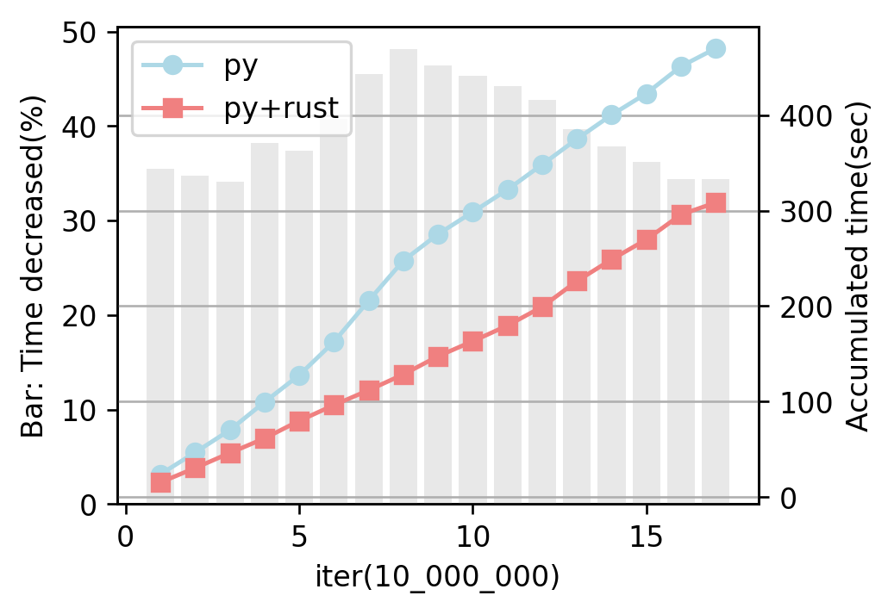

# Google Ngram(v.2020) Yearly Parser - Boosted up with Rust

[Google Ngram](https://storage.googleapis.com/books/ngrams/books/datasetsv3.html) raw files consolidate yearly records. To processs the data by year (ex. modeling Word2Vec by year), one needs to parse raw data into yearly separated files.

Here is a Python code([```yearly_parser.py```](./parsers/yearly_parser.py)) to process each raw files into yearly separated files. Parsing process is boosted up by Rust's Cpython crate.

If ones cicumstance is MS Windows, just use [```rustlib.pyd```](./parsers/rustlib.pyd) file and import it inside the python file. No needs to install Rust.  

Under Linux, needs to build Rust code([```rustlib crate```](./rustlib)) and use a release file with .so extension.


## Increased performance using Rust
* In comparison to using just Python, the time required is reduced by about 35%.
  * For the test used [this .gz file(the downloading would start on opening)](http://storage.googleapis.com/books/ngrams/books/20200217/eng/5-01801-of-19423.gz)
* [Bechmark result](/parsers/test/imgs/py_rust_bench.png)
* 
* Note that Python's smart_open library appears much faster than some Rust's crates when opening .gz file. This is why Rust codes are used partially inside python code here rather than in the overall process from reading to writing files.


##
* MIT License